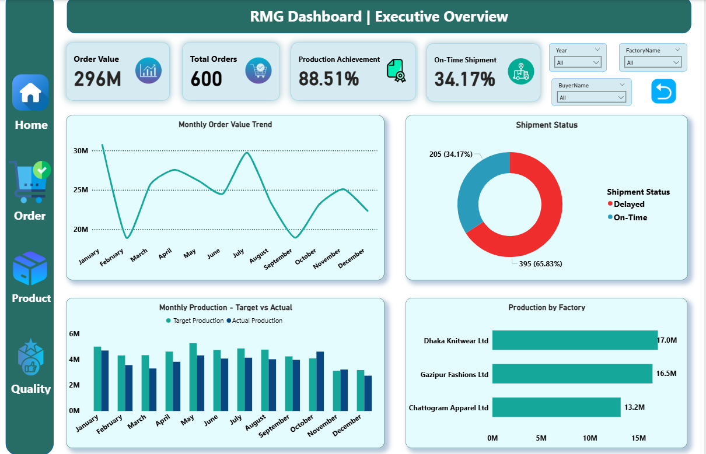
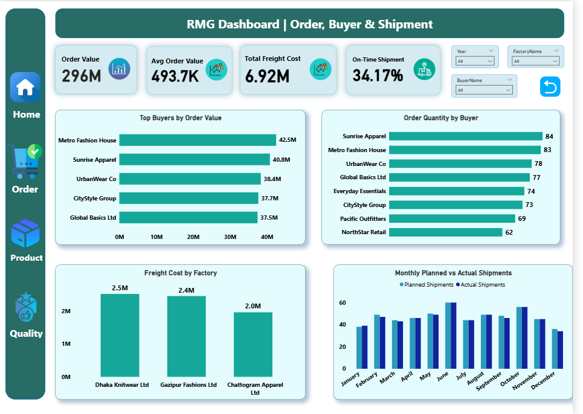
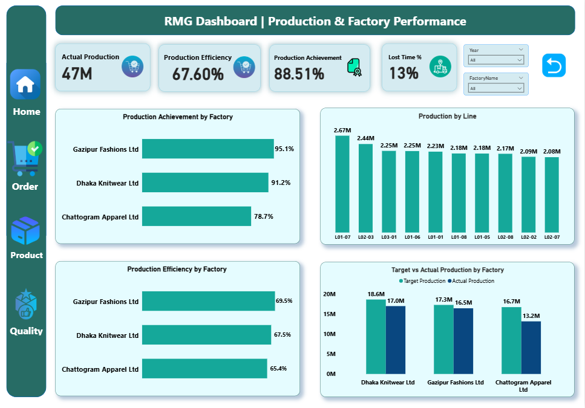
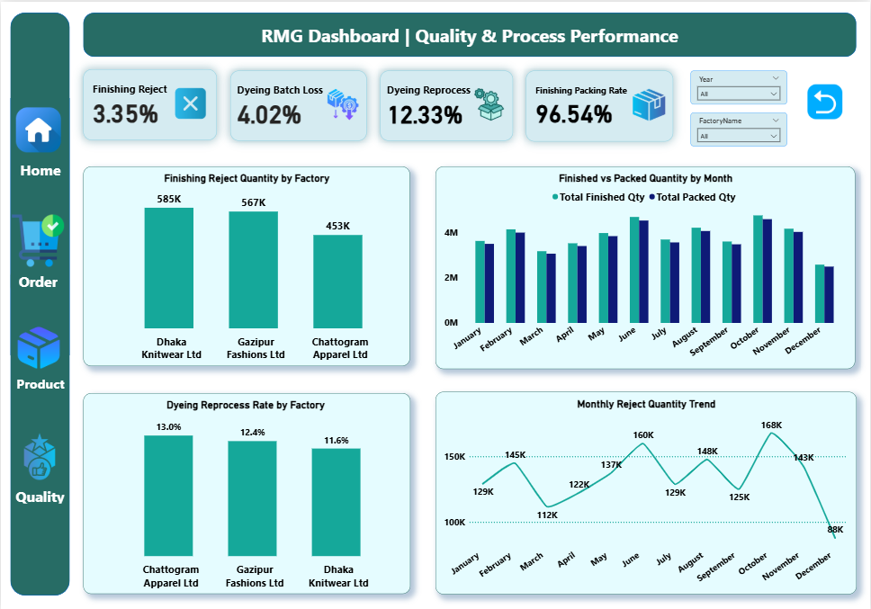
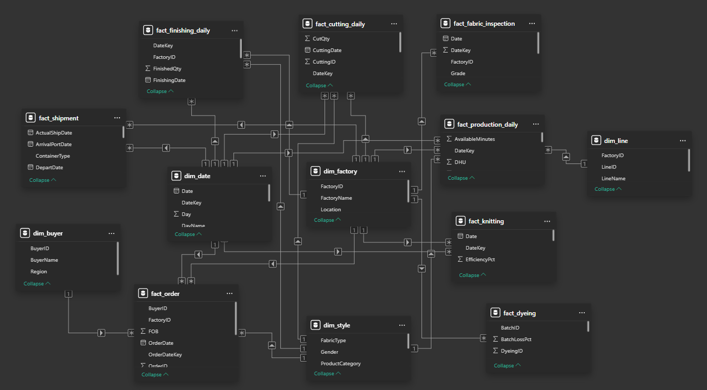

# RMG Manufacturing & Business Performance Dashboard

An interactive Power BI dashboard for analyzing order, buyer, shipment, production, factory, and quality performance in the RMG sector.

## Project Overview

This project transforms RMG business and manufacturing data into an interactive Power BI dashboard.

The dashboard brings together orders, buyers, shipments, production, factories, and quality processes to provide a consolidated view of operational performance.

The project focuses on identifying performance differences, monitoring trends, and highlighting areas that may require further investigation.

## Business Objectives

- Monitor overall order and business performance
- Compare buyer and order performance
- Evaluate shipment performance and freight costs
- Compare production performance across factories and production lines
- Measure production efficiency and achievement
- Monitor quality and process performance
- Identify areas that may require further investigation

## Dashboard Pages

### 1. Executive Overview



Provides a high-level view of overall business and operational performance.

**Key KPIs**
- Total Order Value
- Total Orders
- Production Achievement %
- On-Time Shipment %

**Main Analysis**
- Order value trends
- Shipment performance
- Monthly production target vs actual
- Production performance by factory

### 2. Order, Buyer & Shipment



Focuses on customer orders, buyer performance, and shipment operations.

**Key KPIs**
- Average Order Value
- Total Freight Cost
- On-Time Shipment %

**Main Analysis**
- Buyer performance
- Order value and quantity
- Freight cost by factory
- Planned vs actual shipments
- Shipment performance

### 3. Production & Factory Performance



Focuses on production output, factory performance, and efficiency.

**Key KPIs**
- Actual Production
- Production Achievement %
- Production Efficiency %
- Lost Time %

**Main Analysis**
- Production achievement by factory
- Production output by line
- Production efficiency by factory

### 4. Quality & Process Performance



Focuses on finishing and dyeing quality and process performance.

**Key KPIs**
- Finishing Reject %
- Dyeing Batch Loss %
- Dyeing Reprocess %
- Finishing Packing Rate %

**Main Analysis**
- Finishing reject quantity by factory
- Finished vs packed quantity
- Dyeing reprocess rate by factory
- Monthly reject trends

## Key Business Insights

The dashboard provides visibility into:

- Buyer and order contribution
- Shipment reliability and freight costs
- Factory production achievement and efficiency
- Production line performance
- Finishing rejection and packing performance
- Dyeing loss and reprocessing
- Monthly operational trends

### Selected KPI Findings

| KPI | Result |
|---|---:|
| Production Efficiency | 67.60% |
| Dyeing Reprocess Rate | 12.33% |
| Dyeing Batch Loss | 4.02% |
| Finishing Reject Rate | 3.35% |
| Finishing Packing Rate | 96.54% |

These metrics highlight areas that can be further investigated for operational improvement.

## Business Recommendations

- Review lower-performing factories to understand factors affecting production efficiency and achievement.
- Investigate dyeing reprocessing to identify recurring causes and opportunities to reduce rework.
- Monitor dyeing batch loss to improve material utilization.
- Review finishing rejects by factory and month to identify recurring quality issues.
- Monitor the gap between finished and packed quantities.
- Monitor shipment performance and freight cost differences.
- Track monthly trends to identify performance changes early.

## Data

The project uses **13 CSV datasets** divided into five dimension tables and eight fact tables.

### Dimension Tables

- `dim_buyer`
- `dim_date`
- `dim_factory`
- `dim_line`
- `dim_style`

### Fact Tables

- `fact_order`
- `fact_shipment`
- `fact_production_daily`
- `fact_cutting_daily`
- `fact_knitting`
- `fact_dyeing`
- `fact_fabric_inspection`
- `fact_finishing_daily`

The datasets cover buyers, dates, factories, production lines, styles, orders, shipments, production, cutting, knitting, dyeing, fabric inspection, and finishing.

## Data Model

The project uses a fact and dimension structure to organize business transactions and supporting descriptive information.

The model supports analysis across:

- Time
- Buyers
- Factories
- Production Lines
- Styles

It also supports consistent filtering, aggregation, and KPI calculations in Power BI.

### Data Model Diagram




## Tools & Technologies

| Tool | Purpose |
|---|---|
| **Excel** | Initial data inspection and review |
| **PostgreSQL** | Data querying, validation, and analysis |
| **Power BI** | Data modeling and dashboard development |
| **DAX** | KPI and business measure creation |
| **Git** | Version control |
| **GitHub** | Project repository and documentation |

## Data Preparation Workflow

```text
Raw CSV Data
     ↓
Data Inspection
     ↓
PostgreSQL Analysis
     ↓
Data Validation
     ↓
Power BI Data Model
     ↓
DAX Measures
     ↓
Interactive Dashboard
```

## Repository Structure

```text
RMG-Manufacturing-Business-Performance/
│
├── README.md
├── Documentation/
│   ├── Project_Charter.docx
│   ├── Business_Requirements.docx
│   ├── Data_Profiling_Preparation_Report.docx
│   └── Dashboard_Business_Insights_Report.docx
│
├── Data/
│   ├── dim_buyer.csv
│   ├── dim_date.csv
│   ├── dim_factory.csv
│   ├── dim_line.csv
│   ├── dim_style.csv
│   ├── fact_order.csv
│   ├── fact_shipment.csv
│   ├── fact_production_daily.csv
│   ├── fact_cutting_daily.csv
│   ├── fact_knitting.csv
│   ├── fact_dyeing.csv
│   ├── fact_fabric_inspection.csv
│   └── fact_finishing_daily.csv
│
├── SQL/validation.sql
└── PowerBI/
    └── RMG_Analysis.pbix
```

## Key Skills Demonstrated

- Data Cleaning & Preparation
- SQL Analysis
- PostgreSQL
- Data Modeling
- Fact & Dimension Design
- DAX
- KPI Development
- Power BI Dashboard Design
- Business Analysis
- Data Visualization
- Business Insight Generation
- Technical Documentation

## Project Limitations

- The dashboard is based on historical data and does not provide real-time monitoring.
- The available data may not contain every factor affecting production or quality performance.
- Detailed profitability analysis is not included due to limited financial data.
- The project does not include predictive forecasting or machine learning.
- The dashboard highlights performance gaps but does not identify the exact root cause of every issue.

## Documentation

Detailed project documentation is available in the `Documentation` folder:

- **Project Charter** — Project background, objectives, scope, and expected outcome
- **Business Requirements** — Business needs and dashboard requirements
- **Data Profiling & Preparation Report** — Dataset structure, data preparation, data model, and quality checks
- **Dashboard & Business Insights Report** — Dashboard analysis, key findings, and recommendations

## Author

**Shahadat Hossain Sajim**  
Data Analyst

**Tools:** PostgreSQL • Power BI • Git • GitHub

[LinkedIn](https://www.linkedin.com/in/shahadat-hossain-sajim/)

